  

> **CLASSIFIED OPERATION:** USB ENDPOINT SECURITY & DATA EXFILTRATION PREVENTION  
> **STATUS:** DEPLOYED | **AUTHOR:** MR. CIPHER-X [C|THE]

 

### 🛡️ Operation Abstract

**spyUSB** is an integrated endpoint security framework engineered to neutralize covert data theft and malicious payload execution from portable storage devices. The system utilizes a **Deep Neural Network (DNN)** to dynamically analyze API calls, byte sequences, and system log metadata for malware injection signatures. Upon threat detection, the system autonomously triggers **Tokenization** (Data Masking) to protect sensitive files and initiates **CloudConceal**, a secure, encrypted backup protocol to ensure data integrity and availability.

---

### ⚙️ Endpoint Defence Architecture (Logic Flow)

```mermaid
graph TD;
    A[USB Device Inserted] -->|Metadata & Byte Sequence Extraction| B(System Activity Monitor);
    B -->|API Call Interception| C{DNN Malware Detection Engine};
    C -->|Benign Traffic| D[Allow Standard USB I/O];
    C -->|Suspicious Activity / Malware Signature| E[Trigger Isolation Protocol];
    E --> F{Data Protection & Recovery};
    F -->|Secure Sensitive Data| G[Tokenization & Data Masking];
    F -->|Prevent Data Loss| H[CloudConceal Encrypted Backup];
    G --> I[Quarantine USB Device];
    H --> I;
    I --> J[Alert SOC / System Admin];
    
    style A fill:#1a1a1a,stroke:#00FFFF,stroke-width:2px;
    style I fill:#1a1a1a,stroke:#8A2BE2,stroke-width:2px;
```

---

### 🦠 Threat & Mitigation Matrix

| **Threat Vector** | **Detection / Mitigation Modality** | **Automated Tactical Response** |
| :--- | :--- | :--- |
| **Covert Malware Injection** | Deep Neural Network (DNN) Behavioural Analysis | Detects anomalous process creation and API calls; halts execution immediately. |
| **Data Exfiltration / Theft** | Tokenization & Data Masking | Replaces sensitive plaintext with secure tokens, rendering stolen data useless to attackers. |
| **Data Destruction / Ransomware** | CloudConceal Protocol | Automatically transfers critical files to an encrypted cloud vault for seamless recovery. |

---

### 📸 Digital Evidence & Telemetry Dashboard

*(Note: Proprietary DNN weights and raw cloud access logs are restricted. The following displays the operational dashboard and threat interception telemetry.)*

  
  &nbsp; &nbsp;
  

---

  <code>[ OPERATION TERMINATED - ENDPOINT SECURED ]</code>

